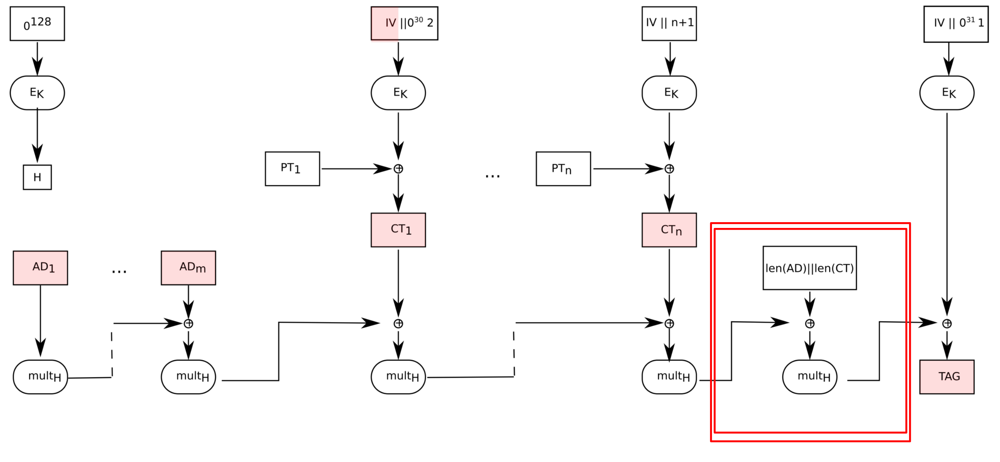

Lestiboudois Maxime
15/04/2025
# Rapport Laboratoire 2 Cryptographie

## Spongy AES
Schéma de la construction de spongy.py:

Pour retrouver le message, j'ai retrouvé le dernier state avant la composition du Tag. Pour cela, j'ai procédé comme suit:
- 

## GCM
1) l'erreur est qu'il manque l'étape encadrée ci-dessous:

3) les IV1 et IV2 sont parfaitement identiques.
