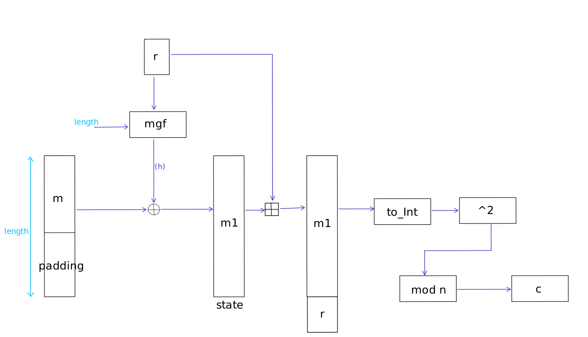
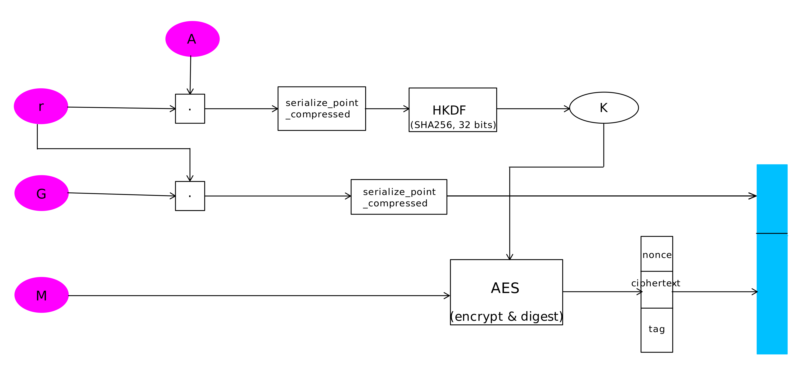

Lestiboudois Maxime </br>
01/06/2025

# Rapport - Laboratoire 3 -Cryptographie

## Ex 1 - "Encryption"
---
### Partie 1


---
### Partie 2
**Chiffrement:**  


1. Générer un nombre aléatoire r :   
$$
r \in_R \{0,1\}^{k_1}
$$

2. Calculer le masque h  
$$
h = \text{MGF}(r, \ell)
$$
3. Appliquer le masquage sur le texte m:  
$$
m' = \text{pad}(m) \oplus h
$$
4. Concaténation de m' et r :  
$$ x = m' \| r
$$
5. Convertir le résultat entier :  
$$
X = \texttt{int.from\_bytes}(x)
$$
6. Chiffrer :  
$$
c = X^2 \bmod n
$$

Sortie: le chiffré $c \in \mathbb{Z}_n$


**Déchiffrement:**  

On connait:  
- c
- p
- q

1. Calculer
$$
    x_p = \sqrt{c} \bmod p,
$$
$$
    x_q = \sqrt{c} \bmod q
$$
2. Calculer les 4 racines possibles modulo $n$ par le théorème des restes chinois (CRT) :
$$
    X_1 = \text{CRT}(x_p, x_q),\quad$$
$$
    X_2 = \text{CRT}(-x_p \bmod p, x_q),\quad
$$
$$
    X_3 = \text{CRT}(x_p, -x_q \bmod q),\quad
$$
$$
    X_4 = \text{CRT}(-x_p \bmod p, -x_q \bmod q)
$$
3. Pour chaque $X_i$ :
    1. Convertir $X_i$ en octets (little endian)
    2. Séparer $x = m' \| r$ (taille de r:128 bytes)
    3. Calculer $h = \text{MGF}(r, |m'|)$
    4. Déduire $M = m' \oplus h$
    5. Si $M$ est un message avec padding valide (ISO7816), le décompresser pour obtenir $m$
---
### Partie 3 
Voici la fonction écrite pour tester le code:
```
def test():
    # Génération des clés
    print("Génération des clés...")
    p, q, n = keyGen()

    original_message = b"la crypto c'est rigolo"
    print("Message original :", original_message)


    # Chiffrement
    c = encrypt(original_message, n)
    print("Chiffrement terminé. Chiffre :", c)

    # Déchiffrement
    m = decrypt(c, p, q)
    print("Déchiffrement terminé. message :", m)
```

La sortie de ce test donne:
```
Génération des clés...
Message original : b"la crypto c'est rigolo"
Chiffrement terminé. Chiffre : 1765020030009823667746050710000583106883560385205670918704331297928703289709661107570605276043074991127179805185024666383908997034386955266466172618431303061135429453875066162070653344300146525647270368595265336436630185778305999879825421162920675817399122387158501204216611804279661140095905279712903001661866495418955022380391612506710825296944696141416712945012877799721411182589118897172368405078250073169292465138989969852193797407283730562506298068090675124402312217038594289828744321751356348809182797724339014908309642263564071553570460713140060254043679809525473390357694068083732310481923583256547243742053

Message décompressé : b"la crypto c'est rigolo"


Déchiffrement terminé. message : b"la crypto c'est rigolo"
```
---
### Partie 4

Nous savons que $$c = x²\ mod\ n$$ et que $$\mathbb{Z}_n \equiv \mathbb{Z}_p \times \mathbb{Z}_q$$   
Nous savons alors que les racines de c sont les suivantes:   
$$ \sqrt c = \pm  x_p\ et\ \sqrt c = \pm x_q $$

En connaissant 2 racines distinctes telles que 
$$ x \not\equiv \pm y\ mod\ n $$, 
nous pouvons donc en déduire 
$$ x²\equiv y²\ mod\ n \\
\rightarrow\  x² -y² \equiv 0\ mod\ n \\ \rightarrow (x-y)(x+y) \equiv 0\ mod\ n\\$$


Nous pouvons donc en conclure que (x-y)(x+y) est divisible par n.

À l'aide de cette infomation, nous pouvons donc trouver que 
$$ pgdc(x-y, n) \in \{p,q\}$$
ce qui nous permet de trouver une des deux valeurs, p ou q. 

Nous pouvons donc conclure, qu'en connaissant les racines d'un texte chiffré, le texte chiffré et le texte en clair, nous sommes capables de retrouver la clé privée ayant servi à chiffrer ce texte et sommes capables de déchiffrer tous les autres textes ayant été chiffrés avec la même clé.

Grâce aux valeurs trouvées pour p et q, nous pouvons utiliser notre fonction decrypt pour déchiffrer le challenge fourni:
```
# challenge (text chiffré)
challenge = 1723690041673310013599400680452119833766236057465450023626011005990088934059047221974215500637649897327077084750433404382695926530216206287417712025043159545875794590559201024798577043811394591906842135480430789384756393899942888030683709285183827188224788579590833174119184830383742330481715742267055087588770990379319946688903272383438855117880053021601240079064095884399048797560102027405079211545396108959326115440834338013165787501993831313062315131726229272315538492860924639365933179261381109861224261769051848425371748702463683512940368749640224531371539200997311612724114125682574118767402031611333814646631

# challenge déchiffré:
plain_challenge = b'Ni! Ni! Ni! We want a leafletting'
```

---
### Partie 5
Le problème difficile sur lequel se base cette construction est le problème de la factorisation de grands entiers.

---
### Partie 6

la redondance ajoutée au message chiffré sert principalement à renforcer la sécurité et à faciliter le déchiffrement. Lorsqu'on déchiffre un message, plusieurs candidats sont possibles à cause des différentes racines carrées modulo n. La redondance, combinée au padding ISO7816, permet de repérer facilement la bonne version du message en éliminant celles qui n’ont pas la bonne structure. Elle joue aussi un rôle important pour éviter certaines attaques : elle rend plus difficile pour un attaquant de deviner ou de forcer un message valide. En plus, elle agit comme un filet de sécurité qui permet de détecter si le message déchiffré est cohérent ou non. Au final, même si elle n’est pas visible pour l’utilisateur, cette redondance contribue fortement à la robustesse du système de chiffrement.

---
## Ex 2 - Courbes elliptiques
---

### Partie 1

---

### Partie 2
**Chiffrement**  
Pour chiffrer un message M avec la clé publique A:
1. On génère un secret aléatoire: 
$$r \in \mathbb{Z}_n $$
2. On calcule le point elliptique, ce point est le secret partagé entre l'émetteur et le détenteur de la clé privée.
$$ S = rA =  r(aG) = arG $$
3. On sérialise S en binaire compressé et on utilise HKDF basé sur SHA256 pour dériver une clé symétrique $ k \in \{0,1\}²⁵⁶ $
4. On utilise cette clé pour chiffrer le message M avec AES en mode GCM, en utilisant le mode encrypt & debug afin d'obtenir en une seule fois, le nonce d'initialisation, le texte chiffré et le tag d'authentification.
5. L'expéditeur envoie au destinataire la clé éphémère compressée $ R = rG $, le nonce d'initialisation, le texte chiffré et le tag d'authentification.


**Déchiffrement**  
Le destinataire connait la clé privé a et reçoit R. 
1. On peut donc calculer le secret partagé, identique au point S utilisé lors du chiffrement
$$ S' = aR = a(rG) = arG $$
2. On sérialise S' en binaire compressé et on utilise HKDF afin de retrouver la clé symétrique k.
3. On utilise cette clé pour déchiffrer le ciphertext en mode AES-GCM, avec le nonce ereCu
4. On vérifie que le tag est valide.
Si le tag est valide, le message n'a donc pas été modifié et le texte déchiffré est légitime.


---
### Partie 3
Voici le test effectué:
```
def test():
    message = b"Hello mister Duc"
    G, E, n = params()
    a, A = keyGen(G, n)
    print("Message original: ", message)
    #chiffrer
    ciphertext = encrypt(A, message, G, n)
    print("Message chiffré: ", ciphertext)

    #déchiffrer
    plain_text = decrypt(a, ciphertext, E)
    print("Message déchiffré: ", plain_text)
```
La sortie de ce test donne:
```
Message original:  b'Hello mister Duc'
Message chiffré:  (b'\x03\x00\x95\xfd\xf8M\x87e\x9f4\x92\xab\x17~\x11B\xb5\x07\x93\xecu\xb5\x95a<\xedezKWc;\xc9', (b'\x97\xbe^)\x9b\xc0\x8b\xbb\xcf\x0f\r\xfd\x1d\xd2\xae\xc5', b'\xdcE\xfa\x0c\x0b$\xc5\x9a\x1c\x9b\x0b\xdc\x7f\nj\x16', b'\xd5)\x04\xb00\x1f<*\x00\xf2\xd5\xb3R\xd0h\xae'))
Message déchiffré:  b'Hello mister Duc'
```
---
### Partie 4
Le problème de cette construction vient de l'initialisation des paramètres. On remarque notamment que la valeur du paramètre n est excessivement petite pour une construction de ce style, ce qui implique que l'on peut bruteforcer la valeur initialement random r en testant toutes les valeurs entrer 1 et n ou utiliser le logarithme discret pour trouver directement la valeur de a, la clé privée.

---
### Partie 5
Voici le message récupéré :
```
la clé privée est:  1659533715143
Message déchiffré:  b'Nobody expects the spanish inquisition ! Our chief weapon is doublets'
```
Dans l'attaque, on résout le logarithme discret (avec la fonction `discret_log` de sage) pour trouver a, la clé privée, telle que rG = aG. 

---
### Partie 6
Pour corriger l'erreur dans la construction, il faut admettre une valeur de clé n plus grande. La norme actuelle demande un minimum de 256 bits pour garantir une bonne sécurité.
Pour une meilleure sécurité, on peut aussi choisir des courbes largement utilisées, auditables et correctement étudiées comme `secp526k1`.

Voici des paramètres basés sur la courbe secp256k1:
```
def params():
    # Paramètres sûrs basés sur la courbe secp256k1 (utilisée en Bitcoin)
    p = 0xFFFFFFFFFFFFFFFFFFFFFFFFFFFFFFFFFFFFFFFFFFFFFFFFFFFFFFFEFFFFFC2F
    a = 0  # Pour secp256k1
    b = 7  # Pour secp256k1

    gx = 55066263022277343669578718895168534326250603453777594175500187360389116729240
    gy = 32670510020758816978083085130507043184471273380659243275938904335757337482424

    E = EllipticCurve(GF(p), [a, b])
    G = E(gx, gy)

    n = G.order()  # Ordre premier de G

    return (G, E, n)
```
---

## Ex 3 - RSA
---
### Partie 1
Voici le test implémenté pour vérifier le code:
```
def test():
    message = b"Hello Teacher"
    print("Message original: ", message)
    key = keygen()         
    pub_key = key.publickey()
    
    #Chiffrement
    c = encrypt(message, pub_key)
    print(c)

    #Déchiffrement
    d = decrypt(c, key)
    print(d)
```

et la sortie qui lui est associée:
```
Message original:  b'Hello Teacher'
b'\x04\xe2DE\x8a\x8c\x17n<\xaa\x83\xdf5A\xe8\xae\x15\x86\xe0\xf3\x9a*\xf2\xa8\xbe\x15oI\xe4}\x9e\xc2Fn\xba\xbf\xf1P\x14\x10\\\x01\r\x05\x1d\xa1\x0e\xd5\x14\x190\xe8fb\xcfJ;\xc6H\xef\xb1\x1e\xce\x80\xe5@$v\xcf\xed\xd6\t\x0f\xb7\x03\x956\n\x10 \xa8\xe7:\xff=Q\x0f\x9a\xcb\xf10#8\x17I\xfe\xe7\x9c\xd8\xdb\x16k#\xe6\x91D\x9ao\xdf\x7f\xc3\xab\x95\xed\x05\x08\x8c\xde\rW\x07\xa3\xf7\xaa\x8f\xc3\xb0\xf2r\x07\x0f\xc3\xe2\xa4=\x8c\xabI!\xfe\xe6\x080oG\xf7<i\xba\xf8\xe8\x01\xe4\xc8\xd1\x16\x10\xd0_\xe8\xc3\xc3@p\xd1i\xd8\xd2\xb7%\xc1^\xb2\x87\xbdq\xa1r\x07\x18\x06\x81\x9e\x0f\xd0\xb0\xe0\x07\xe5\x02\x9a\n\x92\xe9\x9a\x92\xe6\xed<\x99?\x85\xbc\xf2\xef\x1f\xfa\x8a\xca\xa1;@q\x96\x00s\xdb$\xaaP@7`n\xba\xda\x18\x07\xfbfAFQeE\xfbj\xad\xd0\xbc\xd6k=\x13\xba\xb13\xa9\xe4l\xca\xac\x94\x1c\xcd\xc6\xb2\xf0\xe5Z\xbb\xde'
b'Hello Teacher'
```
---
### Partie 2
Les nombres premiers p et q sont extrêmement proches l'un de l'autre. Leur écart maximal est d'environ $ 2¹⁵$, pour des nombre de 1048 bits de base, cela est extrêment faible et permet de facilement factoriser les éléments p et q. On pourrait alors tenter une attaques par factorisation, mais cette approche n'est vraiment efficace que si n est inférieur à 1024 bits. Nous allonf alors tenter une attaque de Fermat.

L'attaque de Fermat consiste à écrire n comme une différence de carrés:
$$ n = a²-b² = (a-b)(a+b) $$ 
ce qui permet de trouver p et q sans tester toutes els divisions.  
Voici la marche à suivre ensuite:
1. On calcule $ a = ceil(\sqrt n) $
2. Tant que $ b² = a² -n $ n'est pas un carré parfait, on augmente a
3. Quand b² est un carré, on a trouvé $p = a-b\ et\ q = a+b$

Ensuite, grâce à p et q, on peut calculer la valeur de phi et, à l'aide de la fonction sage `inverse_mod`, on arrive à retrouver la valeur de la clé de déchiffrement.  
On peut alors reconstruire la clé RSA (avec n, e, d, p et q) et passer le message ainsi que la clé à la fonction decrypt pour trouver le message.

Le message déchiffré est le suivant:
```
b'What is your quest? To seek the holy grail. What is your favorite color? cultivating'
```
